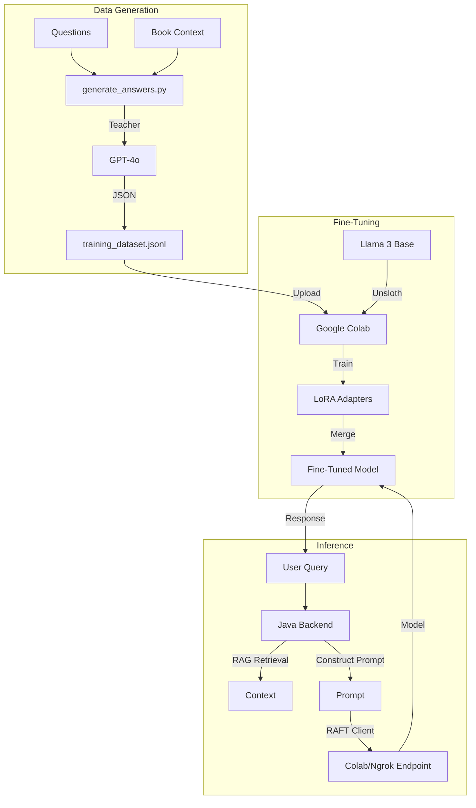

# RAFT (Retrieval Augmented Fine Tuning) Documentation

## 1. Architecture Overview

This project implements a Retrieval Augmented Fine Tuning (RAFT) strategy to train a model that can intelligently decide *when* to perform a vector search and how to answer based *strictly* on provided context.

The core component is the data generation pipeline script `scripts/generate_answers.py`. This script uses a powerful teacher model (GPT-4o) to generate training data for a student model (e.g., Llama 3).



### Workflow

1.  **Question Input**: The process starts with a list of generated questions (`data/generated_questions.jsonl`), each associated with a specific book context snippet.
2.  **Context Grouping**: Questions are grouped by their context to optimize API usage.
3.  **Answer Generation (Teacher Model)**:
    *   The script sends the Context + Questions to OpenAI's API.
    *   The **System Prompt** instructs the model to act as a "Bookshop Assistant".
    *   Crucially, the model is instructed to decide if a database search is needed (`vectorSearch: true/false`) and to format the response as JSON.
4.  **Dataset Formatting**:
    *   The generated answers are paired with the original questions and context.
    *   The output is formatted into a JSONL file suitable for fine-tuning (instruction, input, output).

## 2. Detailed Function and Parameter Description

### `scripts/generate_answers.py`

This Python script handles the generation of the training dataset.

#### Execution Modes (`--mode`)

*   `sync`: Processes groups sequentially using standard chat completions. Best for small datasets or testing.
*   `prepare`: Generates a JSONL file for OpenAI's **Batch API**. This is cost-effective for large datasets. It creates a `batch_input` file.
*   `process`: Takes the output from a completed Batch API job and converts it into the final training dataset format.

#### Key Functions

##### `get_single_user_prompt(context, question)`

Formats the input for the final training example.
*   **Input**: Context string, Question string.
*   **Output**: A formatted string:
    ```
    CONTEXT: ...
    QUESTION: ...
    ```

##### `get_batch_user_prompt(context, questions)`

Formats the input for the teacher model to generate answers efficiently (one context, multiple questions).

##### `generate_answers_sync(client, context, questions)`

Calls OpenAI Chat Completion API in sync mode.
*   **Model**: Defaults to `gpt-4o-mini` (can be changed).
*   **System Prompt**: Uses `SYSTEM_PROMPT_BATCH`.

#### Prompts & Logic

##### `SYSTEM_PROMPT_SINGLE`
Used for the `instruction` field in the final dataset.
*   **Role**: Bookshop Assistant.
*   **Constraint**: Answer *strictly* based on context.
*   **Decision**: Determine if database search is needed (e.g., if user asks to "find" or "recommend").
*   **Output Format**: JSON `{"reply": "...", "vectorSearch": true/false}`.

##### `SYSTEM_PROMPT_BATCH`
Used to generate the answers. Similar to `SINGLE` but optimized for answering a list of questions in one go.

#### Output Format (`data/training_dataset.jsonl`)

Each line is a JSON object:
```json
{
  "instruction": "You are a helpful Bookshop Assistant...",
  "input": "CONTEXT: ...\n\nQUESTION: ...",
  "output": "{\"reply\": \"...\", \"vectorSearch\": true}"
}
```
*   **instruction**: The system prompt defining the persona and rules.
*   **input**: The specific context and user question.
*   **output**: The JSON string containing the model's reply and search decision.

## 3. Model Training (Fine-Tuning)

The generated training data (`data/training_dataset.jsonl`) is used to fine-tune a Llama 3 model.

### Prerequisites & Setup

1.  **Environment**: Google Colab (recommended for free GPU access).
2.  **Base Model**: Llama 3.1 8B (Unsloth optimized version).
3.  **Data**: The `training_dataset.jsonl` generated by the pipeline.

### Training Process

The training is performed using the Unsloth library, which provides efficient fine-tuning (LoRA).

1.  **Upload Data**: The JSONL file is uploaded to the Colab environment.
2.  **Fine-Tuning**:
    *   Load the base model (4-bit quantized for memory efficiency).
    *   Configure LoRA adapters.
    *   Train on the dataset (typically 1-5 epochs depending on data size).
3.  **Export**:
    *   Merge the LoRA adapters into the base model.
    *   Push the merged model to Hugging Face Hub (e.g., `GasparDoesAI/bookshop-llama3-v1`).

### Inference API

Once trained, the model is served via a FastAPI server (often tunneled via ngrok from Colab):

1.  **FastAPI App**: Wraps the fine-tuned model.
2.  **Endpoint**: `/v1/chat/completions` (OpenAI-compatible).
3.  **Logic**:
    *   Accepts a list of messages.
    *   Formats them into an Alpaca-style prompt.
    *   Generates a response using `model.generate()`.
    *   Returns the response as a JSON object.

### Integration with Backend

The backend (`LangChainAiClient` or similar) is configured to point to this inference API:

```properties
my.bookshop.rag.google-colab.url=https://your-ngrok-url.ngrok-free.app/v1
my.bookshop.rag.google-colab.token=dummy
```

## 4. Application Implementation (Java)

The Java Spring Boot application integrates the RAFT strategy by using a specialized client configuration to switch between standard OpenAI models and the fine-tuned RAFT model.

### Core Components

#### `RagConfiguration` & `RagAiClient`

The application defines two beans of type `RagAiClient` in `RagConfiguration.java`:

1.  **`openAiClient`** (`@Primary`):
    *   **Implementation**: `LangChainAiClient`.
    *   **Usage**: Handles **Embeddings** (using `text-embedding-3-small`) and general chat if RAFT is disabled.
    *   **Configuration**: Backed by `OpenAIProperties`.

2.  **`raftClient`**:
    *   **Implementation**: `LangChainAiClient`.
    *   **Usage**: Dedicated to the **Text Generation** phase when RAFT mode is active. It connects to the fine-tuned model (e.g., hosted on Google Colab).
    *   **Configuration**: Backed by `GoogleColabProperties`. It *does not* have an embedding model configured, as it relies on vectors generated by the `openAiClient`.

#### `RagPromptBuilder`

This class is critical for RAFT success. It constructs the runtime prompt sent to the model.

*   **System Prompt Alignment**: The system prompt defined here **must match exactly** (or be semantically equivalent to) the prompt used during data generation (`scripts/generate_answers.py`).
*   **Prompt**:
    > "You are a helpful Bookshop Assistant... Output your response as a JSON object with keys 'reply' (string) and 'vectorSearch' (boolean)..."
*   **Context Injection**: It formats the retrieved `TextSegment` list into the `CONTEXT: ...` block that the fine-tuned model expects.

### Data Management

#### `BookEmbeddingService` & `BookTextChunker`

These classes form the ingestion pipeline that creates the knowledge base.

*   **`BookTextChunker`**: Splits book content (Title, Description, Body) into overlapping chunks.
*   **`BookEmbeddingService`**: Orchestrates the embedding process. It uses `openAiClient.embed()` to generate vectors and saves them to the HANA database via `BookContentChunkRepository`.

#### `BookChunkMatch` & `BookChunkSource`

*   **`BookChunkMatch`**: Represents a search result from the database, containing the similarity score and text.
*   **`BookChunkSource`**: Enum indicating if the match came from the `TITLE`, `DESCRIPTION`, or `BODY`. This helps in understanding *why* a chunk was retrieved.

### Configuration & Monitoring

#### Properties Classes
Type-safe configuration properties map `application.yaml` settings to Java objects:
*   **`OpenAIProperties`**: `openai.base-url`, `openai.api-key`, `openai.chat-model`, `openai.embedding-model`.
*   **`GoogleColabProperties`**: `google-colab.base-url`, `google-colab.api-key`, `google-colab.chat-model`.

#### `AiUsageTracker` & `AiUsageRecord`
Provides observability into the cost and performance of the RAG/RAFT system.
*   **`AiUsageTracker`**: Intercepts every call in `LangChainAiClient`. It records token usage (Input, Output, Total) and persists it.
*   **`AiUsageRecord`**: An immutable record of a single interaction, allowing the tracking of token consumption per model (e.g., comparing the cost of `gpt-4o` vs. the fine-tuned `llama-3`).
