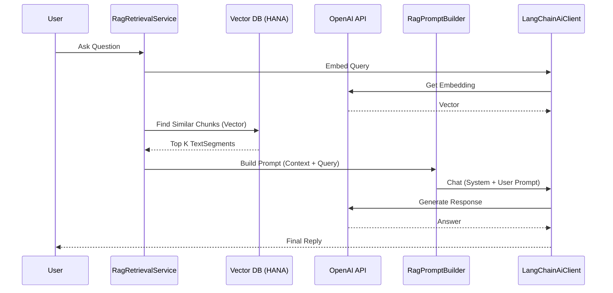

# RAG (Retrieval-Augmented Generation) Documentation

## 1. Architecture Overview

The Retrieval-Augmented Generation (RAG) system in this application is designed to enhance the capabilities of the Bookshop Assistant by providing it with relevant, up-to-date information from the book database. It bridges the gap between the Large Language Model's (LLM) static knowledge and the specific data stored in the application.



### core Components

### Core Components

#### Services & Clients
*   **`RagRetrievalService`**: High-level service that orchestrates the search. It generates embeddings for the query and delegates to the repository for vector comparison.
*   **`BookEmbeddingService`**: Handles the **ingestion** process. It reads books, chunks the text using `BookTextChunker`, generates embeddings via `RagAiClient`, and persists them to the database.
*   **`RagAiClient`** (Interface):
    *   **`openAiClient`** (Bean): The primary implementation using **LangChain4j** and **OpenAI** for both Chat and Embeddings (`text-embedding-3-small` / `gpt-4o-mini`).
    *   **`raftClient`** (Bean): A secondary client pointing to the **Google Colab** instance (fine-tuned model). It *only* supports chat, not embeddings.
*   **`RagPromptBuilder`**: Constructs the actual messages sent to the LLM, injecting the retrieved context and formatting the system prompt.
*   **`AiUsageTracker`**: Observability component that tracks token usage (Input, Output, Total) per model and persists it to `AiUsageRepository`.

#### Repositories
*   **`BookContentChunkRepository`**:
    *   A CAP/CDS repository that provides access to the `BookContentChunk` entity.
    *   **Vector Storage**: Stores the embeddings in a generic vector type (supported by the underlying database, e.g., SAP HANA Cloud Vector Engine).
    *   **Cosine Similarity**: Performs the calculation $sim(A, B) = \frac{A \cdot B}{\|A\| \|B\|}$ to find chunks semantically close to the query.
*   **`BookshopBooksRepository`**: Provides standard SQL access to Book metadata.

## 2. Database Schema (Vector Storage)

The system extends the standard book model to support vector storage. This is defined in `db/book-chunks.cds` and `db-hana/annotations.cds`.

### `BookChunks` Entity

```cds
entity BookChunks : cuid, managed {
    book       : Association to Books;
    chunkIndex : Integer;
    source     : String(40);
    text       : LargeString;
    embedding  : Vector(1536); // Added via extension in db-hana/annotations.cds
}
```

*   **`text`**: The actual text content used for context.
*   **`embedding`**: A 1536-dimensional vector (compatible with OpenAI's `text-embedding-ada-002`) stored natively in SAP HANA Cloud using the `REAL_VECTOR` type.

### Data Flow

### Data Flow (Detailed)

1.  **Vector Generation**:
    *   User Input: "Tell me about space exploration."
    *   `RagRetrievalService` calls `aiClient.embed("Tell me about space exploration.")`.
    *   `LangChainAiClient` sends this text to OpenAI's Embedding API.
    *   Result: `[0.012, -0.045, ...]` (1536 dimensions).

2.  **Vector Similarity Search**:
    *   The service calls `chunkRepository.findSimilarChunks(vector, limit=1000, threshold=0.3)`.
    *   **Database Operation**: The database executes a vector similarity search (k-Nearest Neighbors or similar optimized index search).
    *   **Filtering**: It only returns chunks where the cosine similarity score is $> 0.3$.

3.  **Context Assembly**:
    *   The system takes the matched text chunks.
    *   It retrieves the associated Book metadata (Title, Author).
    *   It constructs a `TextSegment` for each match:
        *   `Text`: "Book Title - Content Chunk..."
        *   `Metadata`: `{ similarity: 0.85, bookId: '...', ... }`

4.  **Generation (RAG/RAFT)**:
    *   The assembled context segments are appended to the system prompt or user message history.
    *   This enriched prompt is sent to the LLM.
    *   The LLM generates a response grounded in the provided context segments.


## 3. Detailed Function and Parameter Description

### `my.bookshop.rag.RagRetrievalService`

This service is the core entry point for RAG operations.

#### `embedForQuery(String text)`

Generates an embedding vector for the given user query.

*   **Parameters**:
    *   `text` (String): The user's input question or text to be embedded.
*   **Returns**:
    *   `double[]`: An array of doubles representing the vector embedding of the input text (1536 dimensions).
*   **Logic**:
    *   Delegates directly to `aiClient.embed(text)` which calls the OpenAI API.

#### `similaritySearch(double[] vector)`

A convenience overload for `similaritySearch(vector, 0.0)`.

*   **Parameters**:
    *   `vector` (double[]): The query vector obtained from `embedForQuery`.
*   **Returns**:
    *   `List<TextSegment>`: A list of relevant text segments found in the database.

#### `similaritySearch(double[] vector, double minSimilarity)`

The core retrieval method.

*   **Parameters**:
    *   `vector` (double[]): The query vector.
    *   `minSimilarity` (double): The minimum similarity score (0.0 to 1.0) required. Defaults to `0.3` if <= 0.
*   **Returns**:
    *   `List<TextSegment>`: Matched book segments with metadata.
*   **Logic**:
    1.  **Search**: Queries `BookContentChunkRepository` for up to 1000 chunks with cosine similarity > `minSimilarity`.
    2.  **Enrichment**: Extracts `bookId`s and fetches full `Books` entities (chunks usually only contain the text snippet, we need the Book Title/Description).
    3.  **Mapping**: Converts each match into a `TextSegment` using `toSegment`.

#### `toSegment(BookChunkMatch match, cds.gen.my.bookshop.Books book)`

(Private Helper) Converts a raw database match into a structured `TextSegment`.

*   **Logic**:
    *   **Text Construction**: Formats the text as `[Title] - [Chunk Text]`. If chunk text is empty, falls back to Book Description.
    *   **Metadata**: Adds `similarity`, `bookId`, `chunkIndex`, and `source` to the segment metadata for debugging or advanced prompting.

### Data Structures

#### `BookChunkMatch` (`my.bookshop.rag.BookChunkMatch`)
A record (DTO) holding intermediate search results before they are converted to segments.
*   **Fields**: `chunkId` (String), `bookId` (String), `chunkIndex` (int), `source` (`BookChunkSource`), `text` (String), `similarity` (double).
*   **Purpose**: Decouples the database projection from the logic that builds the prompt context.

#### `BookChunkSource` (`my.bookshop.rag.BookChunkSource`)
Enum identifying the origin of a text chunk.
*   **Values**:
    *   `TITLE`: Chunk came from the book title.
    *   `DESCRIPTION`: Chunk came from the book description.
    *   `BODY`: Chunk came from the book's full text content.
*   **Usage**: Helps in weighting results or debugging context relevance.

#### `BookTextChunk` (`my.bookshop.rag.BookTextChunk`)
A normalized chunk ready for embedding.
*   **Fields**: `index` (int), `source` (`BookChunkSource`), `text` (String).
*   **Purpose**: Output of `BookTextChunker`, input to `BookEmbeddingService`.

## 4. Data Ingestion & Chunking

The system needs to break down large book texts into manageable pieces for embedding.

### `BookTextChunker`

*   **Strategy**: Character-based splitting with overlap.
*   **Chunk Size**: `4000` characters. This is chosen to fit comfortably within standard embedding model windows (usually ~8191 tokens) while capturing significant context.
*   **Overlap**: `400` characters. Ensures that semantic meaning isn't lost at the boundaries of chunks.
*   **Normalization**: Replaces multiple whitespace characters with a single space.
*   **Boundary Detection**: Attempts to split at sentence boundaries (`.`, `!`, `?` etc.) or spaces to avoid cutting words in half.

### `BookEmbeddingService`

*   **Flow**:
    1.  `reindex(Functions Book)`: Reads Title, Description, and Full Text.
    2.  Calls `chunker.chunk(book)` to get a list of `BookTextChunk` objects.
    3.  **Batch Processing**: Embeds chunks in batches of **10** to respect API rate limits.
    4.  **Optimistic Error Handling**: If a batch fails, it logs the error but continues processing other batches.
    5.  **Persistence**: Saves the chunks and their vectors to `BookContentChunkRepository`.

## 5. Prompt Engineering (`RagPromptBuilder`)

The prompt is the interface between the data and the LLM's reasoning.

### System Prompt
The system prompt is hardcoded to enforce a specific persona and output format:
> "You are a helpful Bookshop Assistant... Output your response as a JSON object with keys 'reply' (string) and 'vectorSearch' (boolean)..."

### Context Injection
When RAG is active, the retrieved segments are injected into the user message:
```text
CONTEXT: 
[Book Title 1] - [Chunk Text]
...
QUESTION: [User Query]
```
This ensures the model attends to the provided facts before answering.

## 6. Configuration & Observability

### Configuration (`RagConfiguration`)
The application defines two distinct AI clients:
1.  **OpenAI Client** (`@Primary`): Used for embeddings and default chat. Configured via `openai.base-url`, `openai.api-key`.
2.  **RAFT Client**: Used when the user toggles "RAFT" mode. Points to the usage-tuned model (e.g., on Google Colab). Configured via `google-colab.base-url`.

### Configuration Properties

#### `OpenAIProperties` (`my.bookshop.rag.OpenAIProperties`)
Maps to `openai.*` in `application.yaml`.
*   `base-url`: API endpoint (defaults to standard OpenAI or proxy).
*   `api-key`: Secret key.
*   `embedding-model`: Name of model for vectors (e.g., `text-embedding-3-small`).
*   `chat-model`: Name of model for RAG chat (e.g., `gpt-4o-mini`).

#### `GoogleColabProperties` (`my.bookshop.rag.GoogleColabProperties`)
Maps to `google-colab.*` in `application.yaml`.
*   `base-url`: Endpoint for the fine-tuned model (e.g., ngrok URL).
*   `api-key`: Auth token (often dummy if using simple ngrok tunnel).
*   `chat-model`: Name of the fine-tuned model (e.g., `bookshop-llama`).

### Token Tracking (`AiUsageTracker`)
*   **Metric**: Tracks `Input`, `Output`, and `Total` tokens per request.
*   **Record Class**: `AiUsageRecord` (DTO capturing `modelName`, `timestamp`, `inputTokens`, `outputTokens`, `totalTokens`).
*   **Storage**: 
    *   **In-Memory**: Keeps a rolling window of the last 200 requests for immediate dashboarding.
    *   **Database**: Persists every record to `AiUsageRepository` for long-term auditing.
